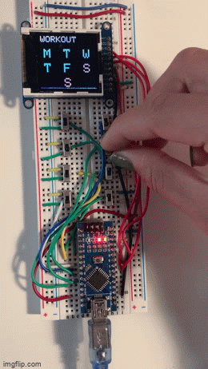

# Daily Goal Tracker

## Introduction

This project was a final project in my high school PLTW Digital Electronics class. I was inspired by [Simone Giertz's Everyday Calendar](https://www.youtube.com/watch?v=-lpvy-xkSNA) as well as the goal to work out daily consistently. (Especially going into college, this goal seems to be more pertinent)

## Main Parts

### [Arduino Nano](https://diyi0t.com/arduino-nano-tutorial/)

While I used an Arduino Uno for prototyping, switched to the arduino nano as it allowed for a more compact final product and was more cost-effective. 

### Switches (x8)

Used to control "on" "off" functionality of each day and clear / next screen option as seen by the eighth switch.

### [Adafruit 1.44" Color TFT with Micro SD Socket](https://learn.adafruit.com/adafruit-1-44-color-tft-with-micro-sd-socket/pinouts)

LCD display used to showcase daily goal progress

## Prototyping

To get the basic switch and clear switch logic down, I first prototyped just the switch functionality using LEDs as demonstrated below:

[insert led gif here]

## Code Implementation

Note that a more detailed explanation of the code can be found by going to DEFinalProject.ino as the code is commented.

#### setup()

The initial setup() is used to print the goal line and days in red ("not done state") to the lcd.

#### loop()

The main loop() function reads inputs from the switches and coordinates with the lcd through the states listed below:

 1. Determine if all days are completed or not
 2. If there are still days incompleted + clear is hit, clear the screen so all days become incomplete
 3. If there are still days incompleted but clear is NOT hit, check if each switch is reading in its signal that would make the task complete. If the correct signla is read in, change the lcd letter to green and mark that day as done
 4. If all days are completed, change the lcd to show the star
 5. If all days are completed, the star screen shows, and the clear switch (eight switch) is flipped, reset the lcd and the entire process starts over again 

### Main technical Challenges

Reading inputs from the switches: depending on how the switch is closed, either 5V or 0V is read in by the arduino microcontroller. However, to make this project more user-friendly, I didn't want the switch state to be fixed (ie: 5V means you met your goal while 0V means you didn't) since it is expected that after clearing the lcd, that all the switches will be in a "goal not met mode" even if the previous state they're in is sending 5V to the microcontroller. Thus, I independently tracked the state of each switch using arrays and flipped the signal that needs to be read in for "goal to be met" each time the clear button is hit (see the clearAll() and flipSignal() functions)

Implementing the Turtle library: I ended up simply having to edit some of the source code as the microcontroller used in the original source code was for a different arduino microcontroller. 

## Attributions:

Turtle Library Used: https://www.instructables.com/Arduino-TFT-Shield-Turtle-Graphics/
